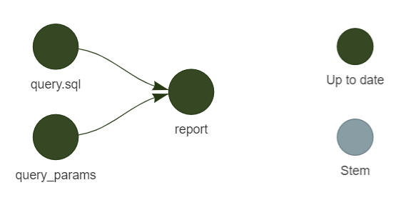

<!-- README.md is generated from README.Rmd. Please edit that file -->

# sqltargets

<!-- badges: start -->

[](https://www.repostatus.org/#wip)
[](https://github.com/daranzolin/sqltargets/actions/workflows/R-CMD-check.yaml)
[](https://CRAN.R-project.org/package=sqltargets)
[](https://cran.r-project.org/package=sqltargets)
[](https://wlandau.github.io/targetopia/)

<!-- badges: end -->

sqltargets makes it easy to integrate SQL files within your [targets
workflows.](https://github.com/ropensci/targets) The shorthand
`tar_sql()` creates two targets: (1) the ‘upstream’ SQL file; and (2)
the ‘downstream’ result of the query. Dependencies can be specified by
calling `tar_load()` within SQL comments. Parameters can be specified
using glue::glue_sql() bracket notation (‘{}’) (or configured using the
`sqltargets.glue_sql_opening_delimiter` and
`sqltargets.glue_sql_closing_delimiter` options.

## Installation

You can install sqltargets from CRAN with:

``` r
install.packages("sqltargets")
```

You can install the development version of sqltargets with:

``` r
remotes::install_github("daranzolin/sqltargets)
```

## Dependencies

Use `tar_load` or `targets::tar_load` within a SQL comment to indicate
query dependencies. Check the dependencies of any query with
`tar_sql_deps`.

``` r
library(sqltargets)
lines <- c(
   "-- !preview conn=DBI::dbConnect(RSQLite::SQLite())",
   "-- targets::tar_load(data1)",
   "-- targets::tar_load(data2)",
   "select 1 AS my_col",
   ""
 )
 query <- tempfile()
 writeLines(lines, query)
 tar_sql_deps(query)
#> [1] "data1" "data2"
```

## Parameters

You can pass parameters (presumably from another object in your targets
project) to `tar_sql()` using one of two ‘template engines’:
[glue](https://github.com/tidyverse/glue) or ‘Jinja’ (courtesy of [the
‘jinjar’ package.)](https://github.com/davidchall/jinjar)

Set the ‘template engine’ with
`sqltargets_option_set("sqltargets.template_engine", "jinjar")`. (‘glue’
is the default.)

With glue:

`query.sql`

``` sql
-- !preview conn=DBI::dbConnect(RSQLite::SQLite())
-- tar_load(params)
select id
from table
where age > {age_threshold}
```

`_targets.R`

``` r
library(targets)
library(sqltargets)
list(
  tar_target(params, list(age_threshold = 30)),
  tar_sql(report, path = "query.sql", params = params)
  )
```



With ‘Jinja’:

`query.sql`

``` sql
-- !preview conn=DBI::dbConnect(RSQLite::SQLite())
-- tar_load(payment_methods)
select
order_id,

sum(case when payment_method = '{{payment_method}}' then amount end) as {{payment_method}}_amount
,

from payments
group by 1
```

`_targets.R`

``` r
library(targets)
library(sqltargets)

sqltargets_option_set("sqltargets.template_engine", "jinjar")

list(
  tar_target(payment_methods, list(payment_methods = c("bank_transfer", "credit_card", "gift_card"))),
  tar_sql(report, path = "query.sql", params = payment_methods)
  )
```

Note that `loop.is_last` differs from typical Jinja (`loop.last`). Refer
to [this ‘jinjar’
vignette](https://davidchall.github.io/jinjar/articles/template-syntax.html)
for other syntactical differences.

## Code of Conduct

Please note that the sqltargets project is released with a [Contributor
Code of
Conduct](https://contributor-covenant.org/version/2/1/CODE_OF_CONDUCT.html).
By contributing to this project, you agree to abide by its terms.

## Acknowledgement

Much of the code has been adapted from [the excellent tarchetypes
package.](https://github.com/ropensci/tarchetypes) Special thanks to the
authors and Will Landau in particular for revolutionizing data pipelines
in R.
